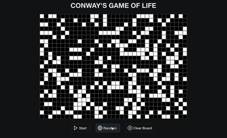

# Conway's Game of Life

Conway's Game of Life created with React and Typescript

Click any square in the grid to change its status even while game is running!

## In Action

1. Click any squares to change their status between alive and dead!

2. Run the game!

3. Start/Stop whenever, clear the board, and randomize as you see fit. You can even click squares to change status while game is running!

4. Watch the game play out!

### Deployment

[Click Here!](https://jaredthacker.github.io/game-of-life/)
